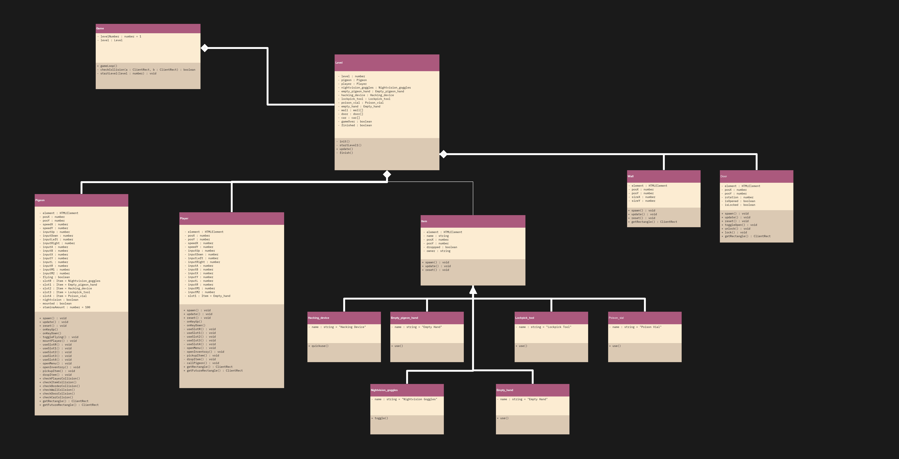

# UML Delivarable
Programmeren 4
2021-06-06
Lucas van der Vegt




## Verantwoording

### General

Mijn game theme genarator woorden waren:

Kind of Fun: Fellowship  
Game Mechanic: Spy  
X-Factor: Pigeons  

Het algemene idee van de game is dat je een player en een pigeon hebt die samen moeten werken om een bepaald doel te bereiken in het level. Het is ook narretive based, dus de verschillende levels zitten aan elkaar verbonden met een verhaallijn.   
Het idee is dat je dit singleplayer of coop multiplayer kan spelen (als je singleplayer speelt ben je zowel de player als de pigeon)  

De input word via een old school snes controller (usb variant) en via keyboard.

De Main Mechanics zijn als volgend: 

**Algemene mechanics:**
- Movement van de player en pigeon   
- Controls  
- Level initialisation  
- Collision (Doors, Walls, Entities)  

**Items**
- Usable Items  
- Picking up and dropping items  
- Inventory slots 

**Pigeon mechanics:**
- Default use
- Quick hack
- Toggle fly/ walk
- Mounting player
- Toggle Nightvision

**Player mechanics:**
- Default use
- Call pigeon

**Door mechanics:**
- Open and close
- lock and unlock

*Ik zal in dit document niet alle individuele onderdelen tot in detail uitleggen, maar alleen de belangrijkste mechanics en relevante onderdelen.*

### Game Class

Laten we beginnen met de game class, omdat het idee is dat er verschillende levels zijn roept de game een level aan. Standaard kiest het level 1.  
Zodra de class word aangemaakt word de `startLevel()` function gecalled en word het level geiniteerd.  
De gameloop roept een update aan van het gestarte level (en daarin worden weer de subclasses geupdate)
In deze class staat een global function `checkCollision()`, deze neemt twee inputs en checkt of er een overlap is in hun `ClientRect` en als dat er is geeft de funtion een `true` value mee terug.  

### Level Class
Deze class word geiniteerd in de `init()` function waarin alle nieuwe classes worden aangemaakt en worden geiniteerd. Alle classes zitten hier in zoals je kan zien aan de variabeles. Ook worden op dit niveau de gameover en level finish gehandeled.
De `update()` function word elke gameLoop gecalled en hierin worden alle updates van de child classes in gecalled.
Alle variabelen in level zijn `private` omdat die alleen binnen de class nodig zijn. De functions ook, maar op een na, `update()` is belangrijk dat die door de game aangeroepen kan worden.  
Het level kan gereset worden met de `reset()` function die vervolgens weer alle reset functions van de classes onder zich aanroept. Deze function is `private`


### element : HTMLElement
Elke class die je fysiek kan zien in de game heeft een `element` (`HTMLElement`) variabele. Deze word gebruikt om de DOM te kunnen manipuleren. Deze staat op `private` omdat je een class alleen direct zelf controle geeft over zichzelf. Als je van buitenaf een element wilt beinvloeden moet je dat via een function in de class doen.

### Position (+ Rotation)
Elke zichtbare class heeft ook een position die aangeeft waar het zich bevind. Dit word aangegeven met de private variabele `posX` & `posY`. Sommige classes hebben ook nog een `rotation` of `size` value wat verdere invloed heeft op hoe het eruit ziet in het level. Dit is allemaal `private` omdat dit alleen door direct door de eigen class geupdate moet worden.

### Speed
De `speedX` & `speedY` variables in de classes met beweegbare classes zijn ervoor om het bewegen mogelijk te maken. Deze zijn `private`. 

### getRectangle() & getFutureRectangle()
Met deze functions kunnen andere classes de `clientRect` callen van een bepaalde class om zo te chechen met de `checkCollision()` function of er een collision is. Daarom is deze function ook in elke class `public`. Met de `getFutureRectangle()` function kan de collision tussen twee verschillende bewegende onderdelen voorspellen, elk bewegend ding heeft ook deze function.

### Update()
De update function zit in elke class, deze word gecalled in het level en zo worden alle onderdelen van het level geupdate per animationframe. Dit kan omdat het level geupdate word uit de gameloop. Hierin staan bijvoorbeeld het updaten van de snelheid, locatie, input etc. Deze function is `public` omdat het van bovenaf moet worden gebruikt.

### Spawn()
In de spawn function worden alle dingen aangeroepen en geinitialiseerd die nodig zijn bij het neerzetten van een object. Denk hierbij aan het plaatsen van het object op de goede plek en de inventory laden met de goede items. Omdat de objecten worden gespawned vanuit het level is deze function `public`

### Reset()
De reset function is ervoor bedoeld om een bepaald object te resetten naar zn originele spawning positie en inhoud.
De function doet twee dingen: 1. hij delete alles van een bepaald object en 2. spawn opnieuw hetzelfde object. Het is een `public` function zodat het level het kan aanroepen


### input & onKey
De pigeon en player zijn allebei bestuurbare karakter in de game. Deze besturing word gedaan via de keyboard inputs (met het idee dat die keys geremapt worden naar een snes controller). Eerst word in een player class de inputs gezet van de desbetreffende controls, dit zijn `private` variabeles. Vervolgens worden die inputs gebruikt om in de `onKeyUp()` & `onKeyDown()` functions te callen van de desbetreffende acties. Deze functions zijn ook `private`.  

### Pigeon
De pigeon heeft al speciale staat (`flying`) dat die kan vliegen of lopen. Pigeon kan ook in de `flying = false` staat op de schouder van de player zitten, dan is die `mounted`. Hij kan ook een default `use()` doen via een item waarmee hij verschillende dingen kan beinvloeden in het level en andere slots met usable items (meer informatie staat bij items).
De pigeon heeft ook een `stamina` bar, de stamina gaat van 0-100 en gaat naar beneden naarmate de pigeon aan het vliegen is. Wanneer het op is word die geforceert op de grond gezet. Als de pigeon zit recharged de stamina weer. De pigeon kan ook `nightvision` aanzetten waarmee hij in het donker kan zien. 
Alle variabelen binnen de pigeon zijn `private`. 

### Player
De player heeft netzoals de pigeon bepaalde usable item slots. De player heeft als ding dat die de pigeon kan terug roepen met `callPigeon()`, dit is vooral handig bij de singleplayer versie van de game. voor de rest zijn er geen speciale dingen aan de player class, alle variabelen en de overige functions zijn `private`.

### Inventory & Drop Item
Allebei de bestuurbare charakters hebben een `inventory` met `itemslots` waar `items` in passen. De items kunnen ook op de grond worden gedropt en worden opgepakt met `pickupItem()` en `dropItem()`. Dit is om pickable items in de game te hebben en te kunnen ruilen tussen de charakters in. Dit staat allemaal op `private`.


### Items
Er zijn een boel items die de player en pigeon kunnen gebruiken in de game. Een item kan in een inventory slot zitten en zo worden aangeroepen bij het gebruik van de player. Een item kan gedropped zijn (`droppped : boolean`) of een owner hebben (`owner : string`). De owner word gezet via `updateOwner()` wanneer het item word opgepakt (`pickup()`). Al deze variabeles zijn `private` en de functions zijn `public` zodat de player ermee kan interacten.

Elk item heeft een overerving in een specifiek soort item. Ik neem 2 voorbeelden:

Empty_pigeon_hand
met de dit item kan je als pigeon bepaalde default uses doen zoals een deur openen of een item oppakken. Deze extension heeft een function die heet `use()`. Deze is public zodat het vanuit de player aangeroepen kan worden.

Hacking_device
Met het hacking device kan je de function `quickuse()` aanroepen die bijv een deur unlocked. In deze function word gecheckt of er bijv een deur in de buurt is en kiest dan voor een deur hack. De `hackDoor()` function is `private` omdat dit al vanuit een andere public function word aangeroepen.

Deze `use()` functions zijn public zodat de players ze van bovenaf kunnen aanroepen.

### Wall
De wall een een solid stuk waar de player en pigeon niet door heen kunnen. De muur heeft geen speciale eigenschappen of functies.

### Door
Een deur kan open of dicht (`toggleOpen()`) of hij kan gelocked (`lock()`) of unlocked (`unlock()`) worden. Dit zijn `public` functions omdat dit beinvloed moet kunnen worden door de players die met het level interacten. Wanneer een deur locked (`isLocked : boolean`) is kan deze niet geopend worden. Deze booleans zijn `private`. Via de `getIsOpened(`) & `getIsLocked()` functions kan je hogerop zien wat de status van de deur is, je krijgt dan een `boolean` terug, dit staat dus op `public`.


## UML Codesnippet

```ts
class Game {
    - levelNumber : number = 1
    - level : Level
    |
    + gameLoop() : void
    + checkCollision(a : ClientRect, b : ClientRect) : boolean
    - startLevel(level : number) : void { new Level(level) }
    has class Level {
        - level : number
        - pigeon : Pigeon
        - player : Player
        - nightvision_goggles : Nightvision_goggles
        - empty_pigeon_hand : Empty_pigeon_hand
        - hacking_device : Hacking_device
        - lockpick_tool : Lockpick_tool
        - poison_vial : Poison_vial
        - empty_hand : Empty_hand
        - wall : wall[]
        - door : door[]
        - car : car[]
        - gameOver : boolean
        - finished : boolean
        |
        - init()
        - startLevel1()
        + update()
        - reset()
        - finish()
        |
        has class Pigeon {
            - element : HTMLElement
            - posX : number
            - posY : number
            - rotation : number
            - speedX : number
            - speedY : number
            - inputUp : number 
            - inputDown : number 
            - inputLeft : number 
            - inputRight : number 
            - inputA : number
            - inputB : number
            - inputX : number
            - inputY : number
            - inputL : number
            - inputR : number
            - inputM1 : number
            - inputM2 : number
            - flying : boolean
            - slotR : Item = Nightvision_goggles
            - slot1 : Item = Empty_pigeon_hand
            - slot2 : Item = Hacking_device
            - slot3 : Item = Lockpick_tool
            - slot4 : Item = Poison_vial
            - nightvision : boolean
            - mounted : boolean
            - staminaAmount : number = 100
            |
            + spawn() : void
            + update() : void
            + reset() : void
            - onKeyUp()
            - onKeyDown()
            - toggleFlying() : void
            - mountPlayer() : void
            - useSlotR() : void
            - useSlot1() : void
            - useSlot2() : void
            - useSlot3() : void
            - useSlot4() : void
            - openMenu() : void
            - openInventory() : void
            - pickupItem() : void
            - dropItem() : void
            + checkPlayerCollision()
            + checkItemCollision()
            + checkBorderCollision()
            + checkWallCollsion()
            + checkDoorCollsion()
            + checkCarCollsion()
            + getRectangle() : ClientRect
            + getFutureRectangle() : ClientRect
        }
        |
        has class Player {
            - element : HTMLElement
            - posX : number
            - posY : number
            - rotation : number
            - speedX : number
            - speedY : number
            - inputUp : number 
            - inputDown : number 
            - inputLeft : number 
            - inputRight : number 
            - inputA : number
            - inputB : number
            - inputX : number
            - inputY : number
            - inputL : number
            - inputR : number
            - inputM1 : number
            - inputM2 : number
            - slot1 : Item = Empty_hand
            |
            + spawn() : void
            + update() : void
            + reset() : void
            - onKeyUp()
            - onKeyDown()
            - useSlotR() : void
            - useSlot1() : void
            - useSlot2() : void
            - useSlot3() : void
            - useSlot4() : void
            - openMenu() : void
            - openInventory() : void
            - pickupItem() : void
            - dropItem() : void
            - callPigeon() : void
            + getRectangle() : ClientRect
            + getFutureRectangle() : ClientRect
        }
        has class Item {
            - element : HTMLElement
            - name : string
            - posX : number
            - posY : number
            - droppped : boolean
            - owner : string
            |
            + spawn() : void
            + update() : void
            + reset() : void
            + drop() : void
            + pickup() : void
            + updateOwner() : void
            |
            extends class Hacking_device {
                - name : string = "Hacking Device"
                |
                + quickuse()
                - hackDoor()
            }
            extends class Empty_pigeon_hand {
                - name : string = "Empty Hand"
                |
                + use()
            }
            extends class Lockpick_tool {
                - name : string = "Lockpick Tool"
                |
                + use()
            }
            extends class Poison_vial {
                - name : string = "Poison Vial"
                |
                + use()
            }
            extends class Nightvision_goggles {
                - name : string = "Nightvision Goggles"
                |
                + toggle()
            }
            extends class Empty_hand {
                - name : string = "Empty Hand"
                |
                + use()
            }
        }
        |
        has class Wall {
            - element : HTMLElement
            - posX : number
            - posY : number
            - sizeX : number
            - sizeY : number
            |
            + spawn() : void
            + update() : void
            + reset() : void
            + getRectangle() : ClientRect
        }
        |
        has class Door {
            - element : HTMLElement
            - posX : number
            - posY : number
            - rotation : number
            - isOpened : boolean
            - isLocked : boolean
            |
            + spawn() : void
            + update() : void
            + reset() : void
            + getIsOpened() : boolean
            + getIsLocked() : boolean
            + toggleOpen() : void
            + unlock() : void
            + lock() : void
            + getRectangle() : ClientRect
        }
    }
}

```